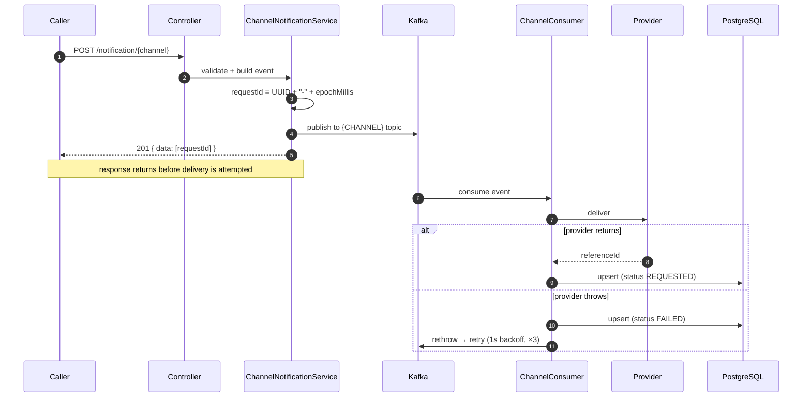

<div align="center">

# 📯 Herald

**A Kafka-driven notification microservice for Email, SMS, and In-App delivery.**

[](https://openjdk.org/projects/jdk/21/)
[](https://spring.io/projects/spring-boot)
[](https://kafka.apache.org/)
[](https://www.postgresql.org/)
[](https://redis.io/)

[Quick Start](#-quick-start) · [API](#-api) · [Architecture](#-architecture) · [Docs](docs/) · [Bruno Collection](apis/)

</div>

---

## What it does

You POST a notification. Herald hands back a `requestId` in milliseconds and gets out of your way — the actual delivery happens asynchronously on the other side of a Kafka topic. Providers fail, retries happen, outcomes land in PostgreSQL, and you poll the `requestId` whenever you care.

On top of that pipeline it also does **OTPs** (BCrypt-hashed, Redis-backed, TTL'd) and **templates** (stored once, triggered with variables).

> [!IMPORTANT]
> `201 Created` means **accepted**, not **delivered**. Nothing is written to the DB at REST time — the row appears only after a consumer processes the event. A status lookup fired immediately after the 201 can legitimately return `null`.

## ✨ Features

| | |
|---|---|
| 📧 **Multi-channel** | Email (Mailjet), SMS (Twilio), In-App (DB inbox) |
| ⚡ **Event-driven** | One Kafka topic per channel, decoupled producers/consumers |
| 🧩 **Templates** | Reusable Email/SMS bodies with `{{variable}}` substitution |
| 🔐 **OTP** | 5-digit code, BCrypt-hashed into Redis with TTL, delivered through the same pipeline |
| 🔁 **Retries** | 3 attempts, 1s backoff, manual ack (`MANUAL_IMMEDIATE`) |
| 🔎 **Status tracking** | Query any notification by `requestId` |
| 🗃️ **Versioned schema** | Flyway migrations, `ddl-auto: validate` |
| 📊 **Observability** | Elastic APM + Logstash + Kibana |
| 🚢 **Ship-ready** | Dockerfile, Docker Compose, k8s manifests, sealed secrets |

## 🏗 Architecture

Every outbound channel walks the same five steps. Only the topic, the provider, and the DTO change.



### Channel matrix

| Channel | Endpoint | Topic | Consumer | Provider | External call |
|---------|----------|-------|----------|----------|---------------|
| 📧 Email | `POST /notification/email` | `EMAIL` | `EmailConsumer` | `MailjetImpl` | Mailjet `v3.1/send` |
| 💬 SMS | `POST /notification/sms` | `SMS` | `SMSConsumer` | `TwilioImpl` | Twilio form POST |
| 🔔 In-App | `POST /notification/inapp` | `IN_APP` | `InAppConsumer` | `InAppImpl` | none — writes a local row |

OTP and Templates aren't channels. They're compositions that end up calling `EmailNotificationService` / `SMSNotificationService`, so they inherit the whole pipeline above.

## 🚀 Quick Start

### Prerequisites

- Java 21 · Docker & Docker Compose · a PostgreSQL you can point at
- Maven not required — the wrapper (`./mvnw`) is included

### 1. Environment

Drop a `.env.properties` in the project root (auto-imported by `application.yml`) or export these:

```properties
DB_URL=jdbc:postgresql://localhost:5432/herald
KAFKA_BROKER_URL=localhost:9092
MAILJET_APIKEY=
MAILJET_SECRET=
TWILIO_BASEURL=
TWILIO_USERNAME=
TWILIO_PASSWORD=
TWILIO_SERVICE_ID=
```

That's the whole list for local development — the compose broker is plaintext and needs no Kafka credentials.

> [!NOTE]
> `KafkaTopicConfig` creates topics with replication factor 2, which the single-broker compose setup cannot honour. Spring logs the rejection and boots anyway; create the topics by hand if you need them locally.

<details>
<summary><b>Connecting to a secured (managed) Kafka broker</b></summary>

Three extra variables, no profile and no cert file:

```properties
KAFKA_SECURITY_PROTOCOL=SASL_SSL
KAFKA_USERNAME=
KAFKA_PASSWORD=
```

`security.protocol` defaults to `PLAINTEXT`; flipping it to `SASL_SSL` activates the `SCRAM-SHA-256` config that is already in `application.yml`. The broker's CA is **inlined** there as `kafka.ssl.ca-pem` and fed to Kafka's PEM truststore (`ssl.truststore.type: PEM`), so there is no `.jks`/`.p12` to ship, no truststore password, and nothing to mount. It is a public CA certificate with no private key.

Rotating the CA: replace the PEM block in `application.yml`, or override at runtime with `KAFKA_CA_PEM` (needs real newlines — trivial in a k8s ConfigMap, awkward in a `.properties` file). The bundled Aiven project CA expires **2036-07-30**.

</details>

### 2. Infrastructure

```bash
docker-compose up -d     # Kafka, Redis Stack, Elasticsearch, Logstash, Kibana, APM Server
```

> [!NOTE]
> PostgreSQL is **not** in the compose file — bring your own and point `DB_URL` at it. Flyway creates the schema on boot.

### 3. Run

```bash
./mvnw clean package
./mvnw spring-boot:run
```

Herald listens on **http://localhost:6069**.

### 4. Poke it

```bash
curl -X POST http://localhost:6069/notification/email \
  -H 'Content-Type: application/json' \
  -d '{"toEmail":"user@example.com","toName":"User","subject":"Hi","content":"Hello world"}'
# → 201 { "data": ["<requestId>"], "status": 201 }

curl "http://localhost:6069/notification?requestId=<requestId>"
```

Or open the [Bruno collection](apis/) — every endpoint, pre-wired, with `requestId` chaining between requests.

## 📡 API

<details open>
<summary><b>Notifications</b></summary>

| Method | Path | Description |
|--------|------|-------------|
| `POST` | `/notification/email` | Trigger an email notification |
| `POST` | `/notification/sms` | Trigger an SMS notification |
| `POST` | `/notification/inapp` | Trigger an in-app notification |
| `GET`  | `/notification?requestId=` | Get notification status by request ID |
| `GET`  | `/notification/inapp?uuid=` | Get a user's in-app inbox |

</details>

<details>
<summary><b>Templates</b></summary>

| Method | Path | Description |
|--------|------|-------------|
| `POST` | `/template/create/email` | Create an email template |
| `POST` | `/template/create/sms` | Create an SMS template |
| `POST` | `/template/trigger/email` | Trigger a stored email template |
| `POST` | `/template/trigger/sms` | Trigger a stored SMS template |

Bodies use `{{placeholder}}` syntax, resolved by `TemplateRenderer` at trigger time.

</details>

<details>
<summary><b>OTP</b></summary>

| Method | Path | Description |
|--------|------|-------------|
| `POST` | `/otp/request` | Generate and send an OTP |
| `POST` | `/otp/validate` | Validate a submitted OTP |

Flow: generate 5-digit code → BCrypt hash → store in Redis with TTL → deliver via the notification pipeline → validate by BCrypt compare → delete on success.

</details>

<details>
<summary><b>Example payloads</b></summary>

```jsonc
// POST /notification/email
{ "toEmail": "user@example.com", "toName": "User", "subject": "Hi", "content": "Hello world" }

// POST /notification/sms
{ "toMobile": "+15551234567", "content": "Your code is ready" }

// POST /notification/inapp
{ "uuid": "user-123", "title": "New message", "content": "You have an update" }
```

</details>

## 🧱 Tech Stack

| Concern | Technology |
|---------|------------|
| Language | Java 21 |
| Framework | Spring Boot 3.5.9 |
| Messaging | Apache Kafka 3.7.0 (`spring-kafka`) |
| Database | PostgreSQL + Flyway |
| Cache | Redis Stack (Jedis) |
| Email | Mailjet API |
| SMS | Twilio API |
| Observability | Elastic APM, Logstash, Kibana, Spring Actuator |
| Testing | JUnit 5, Testcontainers |
| Build | Maven, Spotless, JaCoCo |

## 📁 Project Structure

```
src/main/java/com/notification/herald/
├── configurations/       # Kafka, Redis, RestClient, beans, exception handler
├── controllers/          # Notification, Email, SMS, InApp, Template, Otp
├── services/             # Notification, Email, SMS, InApp, Otp, Template, Kafka, persistence
├── consumers/            # EmailConsumer, SMSConsumer, InAppConsumer (Kafka listeners)
├── providers/
│   ├── mail/             # MailProvider + MailjetImpl
│   ├── sms/              # SMSProvider + TwilioImpl
│   └── inapp/            # InAppProvider + InAppImpl
├── dto/                  # Request/response DTOs (mail, sms, inapp, otp, template)
├── entities/             # NotificationEntity, InAppNotificationEntity, TemplateEntity
├── enums/                # NotifTypeEnum, NotificationStatusEnum, provider/lang enums
├── repository/           # Notification, InApp, Template (Spring Data JPA)
└── utils/                # MailUtil, SMSUtil, RequestUtils, TemplateRenderer
```

## 🔌 Ports

| Service | Port |
|---------|------|
| **Herald** | **6069** |
| Kafka | 9092 |
| Redis / RedisInsight | 6379 / 8001 |
| Elasticsearch | 9200 |
| Logstash | 5044, 5000, 9600 |
| Kibana | 5601 |
| APM Server | 8200 |

## 🛠 Development

```bash
./mvnw test              # JUnit 5 + Testcontainers; JaCoCo report at target/site/jacoco/
./mvnw spotless:apply    # fix formatting
./mvnw verify            # Spotless check runs here and fails the build if unformatted
```

- **Formatting** — Spotless with Google Java Format, enforced on `verify`.
- **Coverage** — JaCoCo runs during the `test` phase.
- **CI** — GitHub Actions builds the Docker image on every push to `master`.

## ☸️ Deployment

```bash
docker build -t herald .

docker run --rm -p 6069:6069 \
  -e DB_URL=... \
  -e KAFKA_BROKER_URL=... -e KAFKA_USERNAME=... -e KAFKA_PASSWORD=... \
  -e KAFKA_TRUSTSTORE_PASSWORD=... \
  -e MAILJET_APIKEY=... -e MAILJET_SECRET=... \
  herald
```

The image defaults to `SPRING_PROFILES_ACTIVE=cloud` and supplies `KAFKA_TRUSTSTORE_PATH` itself — pass every other secret in individually rather than mounting the whole `.env`.

```bash
kubectl apply -f k8s/     # deployment, service, redis, sealed secret
```

> [!WARNING]
> The k8s manifests are incomplete: `k8s/deployment.yaml` injects no env and mounts no secrets, and the sealed secret carries only the Mailjet keys. A pod started from them cannot reach Kafka or PostgreSQL.

## 📚 Documentation

| Doc | Contents |
|-----|----------|
| [docs/architecture.md](docs/architecture.md) | Components, runtime topology, config, startup |
| [docs/data-model.md](docs/data-model.md) | Tables, entities, enums, migration history |
| [docs/error-handling.md](docs/error-handling.md) | Retry policy, exception mapping, status codes |
| [docs/known-issues.md](docs/known-issues.md) | Defects and sharp edges in the current code |
| [docs/flows/](docs/flows/) | End-to-end traces: email, sms, in-app, otp, template, status lookup |
| [apis/](apis/) | Runnable Bruno collection for every endpoint |

## 🤝 Support

Issues, questions, and contributions — open an issue on the repository.
