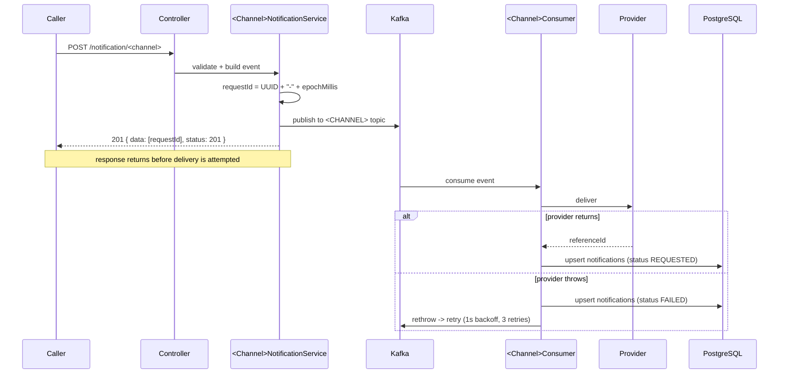
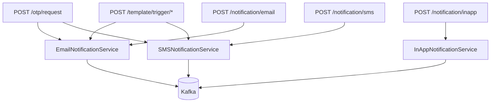

# Herald Documentation

Herald is a Spring Boot notification microservice. A caller POSTs a notification
over REST, Herald publishes it to Kafka, a consumer delivers it through the
channel provider (Mailjet / Twilio / local inbox), and the outcome is persisted
to PostgreSQL.

## Index

| Doc | Contents |
|-----|----------|
| [architecture.md](architecture.md) | Components, runtime topology, config, ports, startup |
| [data-model.md](data-model.md) | Tables, entities, enums, migration history |
| [error-handling.md](error-handling.md) | Retry policy, exception mapping, status codes |
| [known-issues.md](known-issues.md) | Defects and sharp edges found in the current code |
| [flows/email.md](flows/email.md) | Email send flow, end to end |
| [flows/sms.md](flows/sms.md) | SMS send flow, end to end |
| [flows/in-app.md](flows/in-app.md) | In-app send + inbox read flow |
| [flows/otp.md](flows/otp.md) | OTP issue and validate flow |
| [flows/template.md](flows/template.md) | Template create and trigger flow |
| [flows/status-lookup.md](flows/status-lookup.md) | Notification status lookup |

Runnable requests for every endpoint live in the Bruno collection at
[../apis/](../apis/).

## The one flow that explains all the others

Every outbound channel follows the same five steps. The channel only changes
which topic, which provider, and which DTO.

Two consequences worth internalizing:

1. **Nothing is written to the DB at REST time.** The row appears only once a
   consumer has processed the event. A status lookup done immediately after the
   201 can legitimately return `null`.
2. **The 201 means "accepted", never "delivered".** Provider failures surface
   only in the persisted status, never in the HTTP response.

## Channel matrix

| Channel | Endpoint | Topic | Service | Consumer | Provider | External call |
|---------|----------|-------|---------|----------|----------|---------------|
| Email | `POST /notification/email` | `EMAIL` | `EmailNotificationService` | `EmailConsumer` | `MailjetImpl` | Mailjet `POST send` |
| SMS | `POST /notification/sms` | `SMS` | `SMSNotificationService` | `SMSConsumer` | `TwilioImpl` | Twilio form POST |
| In-app | `POST /notification/inapp` | `IN_APP` | `InAppNotificationService` | `InAppConsumer` | `InAppImpl` | none — writes a local row |

OTP and Templates are not channels. They are compositions that end up calling
`EmailNotificationService` / `SMSNotificationService`, so they inherit the whole
pipeline above.

