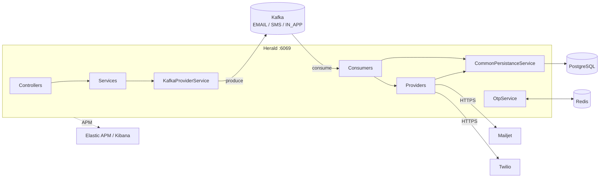

# Architecture

## Layers

```
controllers/     REST entry points, bean validation, status passthrough
services/        request validation, requestId generation, Kafka publish
consumers/       @KafkaListener per topic, provider dispatch, persistence
providers/       one impl per vendor behind a channel interface
utils/           provider registry (MailUtil, SMSUtil), template renderer, id gen
repository/      Spring Data JPA
entities/        JPA mappings onto Flyway-managed tables
configurations/  Kafka, Redis, RestClient beans, @ControllerAdvice
```

Controllers never touch Kafka or the DB directly. Consumers never talk to
controllers. The only shared write path is `CommonPersistanceService`.

## Runtime topology



## Provider registry

`MailUtil` and `SMSUtil` receive every `MailProvider` / `SMSProvider` bean by
constructor injection and index them by a derived key:

```java
provider.getClass().getSimpleName().toLowerCase().replace("impl", "")
```

So `MailjetImpl` registers as `mailjet` and `TwilioImpl` as `twilio`, matching
`MailProviderEnum.MAILJET.getValue()` / `SMSProviderEnum.TWILIO.getValue()`.
Adding a vendor means adding one class named `<Vendor>Impl` plus an enum
constant — no wiring changes.

Consumers currently hardcode the enum (`MailProviderEnum.MAILJET`), so provider
selection is not yet per-request.

## Request id

`RequestUtils.generateRequestId()` returns `UUID + "-" + System.currentTimeMillis()`.
It is the `notifications.notification_id` primary key, the correlation id given
back to the caller, and — for OTP — the Redis key suffix. It is generated in the
service layer, before publishing, so the caller can poll for it.

## Kafka configuration

`KafkaConfig` builds the listener container factory by hand:

```java
new DefaultErrorHandler(new FixedBackOff(1000L, 3))   // 3 retries, 1s apart
factory.getContainerProperties().setDeliveryAttemptHeader(true);
```

`setDeliveryAttemptHeader(true)` is what makes `@Header(KafkaHeaders.DELIVERY_ATTEMPT)`
resolve in the consumers; without it they would fail to bind.

Serialization comes from `application.yml`: JSON producer/consumer with
`spring.json.trusted.packages: '*'`.

Topics are not declared as `NewTopic` beans — the broker must have auto-creation
enabled, or `EMAIL` / `SMS` / `IN_APP` must exist already.

> Note: because the factory is constructed manually rather than through Spring
> Boot's `ConcurrentKafkaListenerContainerFactoryConfigurer`, the
> `spring.kafka.listener.*` properties in `application.yml` (including
> `ack-mode: MANUAL_IMMEDIATE`) are not applied to it. See
> [known-issues.md](known-issues.md).

## Redis

`RedisConfig` builds a Jedis pool (maxTotal 5, maxIdle 2, minIdle 1,
testOnBorrow) and a `RedisTemplate<String, String>` with String serializers on
both key and value. Used solely for OTP hashes.

## Outbound HTTP clients

`BeanConfigurations` exposes two `RestClient` beans, each pre-loaded with basic
auth and the content type the vendor expects:

| Bean | Base URL | Auth | Content type |
|------|----------|------|--------------|
| `mailjetClient` | `https://api.mailjet.com/v3.1/` | API key / secret | `application/json` |
| `twilioClient` | `${TWILIO_BASEURL}` | account SID / token | `application/x-www-form-urlencoded` |

Neither client sets a timeout, so both inherit the JDK default (effectively
unbounded connect/read). A hung vendor blocks the consumer thread.

## Configuration

Port **6069** (`server.port`), not 9500.

Required environment variables:

```
MAILJET_APIKEY      MAILJET_SECRET
TWILIO_BASEURL      TWILIO_USERNAME
TWILIO_PASSWORD     TWILIO_SERVICE_ID
```

Bound through `@ConfigurationPropertiesScan("com.notification.herald.configurations")`
into `MailjetConfiguration` / `TwilioConfiguration`.

The sender identity for email is fixed in `application.yml`
(`mail.mailjet.email` / `mail.mailjet.name`) — callers cannot override the From
address.

Infrastructure endpoints (Postgres on Neon, Kafka on Aiven) are currently
hardcoded in `application.yml`, credentials included. See
[known-issues.md](known-issues.md).

## Startup

```bash
docker-compose up -d     # Kafka, Redis, ELK
./mvnw spring-boot:run
```

Flyway runs on boot (`spring.flyway.enabled: true`, `validate-on-migrate`), then
Hibernate validates the schema (`ddl-auto: validate`) — a drifted schema fails
startup rather than silently mutating.

The Elastic APM agent attach in `HeraldApplication.main` is commented out; APM
settings in `application.yml` have no effect until it is re-enabled or the agent
is attached via `-javaagent`.
