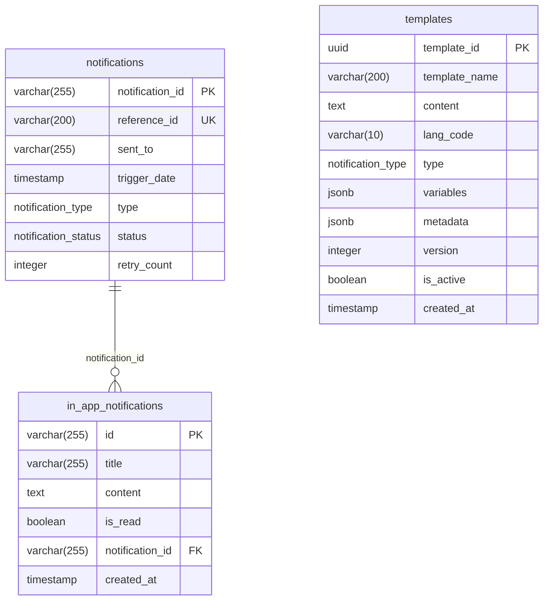

# Data Model

Three tables, all Flyway-managed. Hibernate runs in `validate` mode, so the
entities must match the migrations exactly or startup fails.



## `notifications`

The delivery ledger — one row per notification request, written by consumers.

| Column | Notes |
|--------|-------|
| `notification_id` | PK. The `requestId` handed to the caller: `UUID + "-" + epochMillis`. Was `UUID` until V2. |
| `reference_id` | **UNIQUE.** Vendor id, or the literal `FAILED_REFERENCE` on failure — see [known-issues](known-issues.md#failed_reference-collides-with-a-unique-constraint). |
| `sent_to` | Email, mobile, or recipient uuid depending on channel. Added NOT NULL in V6. |
| `trigger_date` | Defaults to `CURRENT_TIMESTAMP`. **Not mapped on `NotificationEntity`**, so it is invisible to the API. |
| `type` | Postgres enum `notification_type`. |
| `status` | Postgres enum `notification_status`, DB default `QUEUED`. |
| `retry_count` | `deliveryAttempt - 1`; `0` on first pass, `3` after the retry budget. |

## `in_app_notifications`

The inbox. One row per in-app message, written by `InAppImpl` during consumption.

| Column | Notes |
|--------|-------|
| `id` | PK, a random UUID minted by the provider. Also serves as the parent's `reference_id`. |
| `is_read` | `false` on insert; flipped by `GET /notification/inapp` as a read side effect. |
| `notification_id` | FK to `notifications`. Indexed (`idx_in_app_notifications_notification_id`). |

No `uuid` column — the recipient is resolved by joining to
`notifications.sent_to`. That makes the FK load-bearing for reads, not just
referential hygiene: an inbox row whose parent is missing is unreachable by
`findUnreadInboxByUuid`.

## `templates`

| Column | Notes |
|--------|-------|
| `template_id` | PK, `gen_random_uuid()` DB-side; entity maps it `insertable=false` + `@Generated(INSERT)`. |
| `variables` | JSONB `List<String>`. Declared but never enforced against `content`. |
| `metadata` | JSONB `Map<String,Object>`. Holds `title` for email templates. |
| `version` / `is_active` | Always written `1` / `true`. No API mutates them. |
| — | `CONSTRAINT uq_template UNIQUE (template_name, type, lang_code)` |

`lang_code` is stored verbatim and matched exactly on lookup, while
`LangCode.validate` accepts any casing — so `EN` and `en` are two different
templates that both pass validation. See [flows/template.md](flows/template.md).

## Postgres enum types

```sql
CREATE TYPE notification_type   AS ENUM ('EMAIL', 'SMS', 'WHATSAPP');  -- V1
ALTER TYPE  notification_type   ADD VALUE IF NOT EXISTS 'IN_APP';      -- V5
CREATE TYPE notification_status AS ENUM ('QUEUED', 'FAILED', 'REQUESTED');
```

Mapped with `@JdbcTypeCode(SqlTypes.NAMED_ENUM)`, so Hibernate binds them as
native enums rather than strings or ordinals.

Two mismatches between DB and Java:

- `WHATSAPP` exists in the DB type but not in `NotifTypeEnum`. Reading a row with
  that value would fail to deserialize. Nothing writes it today.
- `NotificationStatusEnum.QUEUED` exists in both but is never written by code —
  a row can only carry it if inserted outside the application.

## Migrations

| Version | Change |
|---------|--------|
| V1 | Create `notification_type` / `notification_status` enums and `notifications` |
| V2 | `TRUNCATE notifications`, then `notification_id` UUID → `VARCHAR(255)` |
| V3 | Drop `user_id` |
| V4 | Create `templates` |
| V5 | Add `IN_APP` to `notification_type` |
| V6 | Add `sent_to VARCHAR(255) NOT NULL` |
| V7 | Create `in_app_notifications` + FK index |

V2 truncates and V6 adds a NOT NULL column without a default — both are
destructive against a populated database. V6 in particular fails outright if
`notifications` has rows when it runs.
