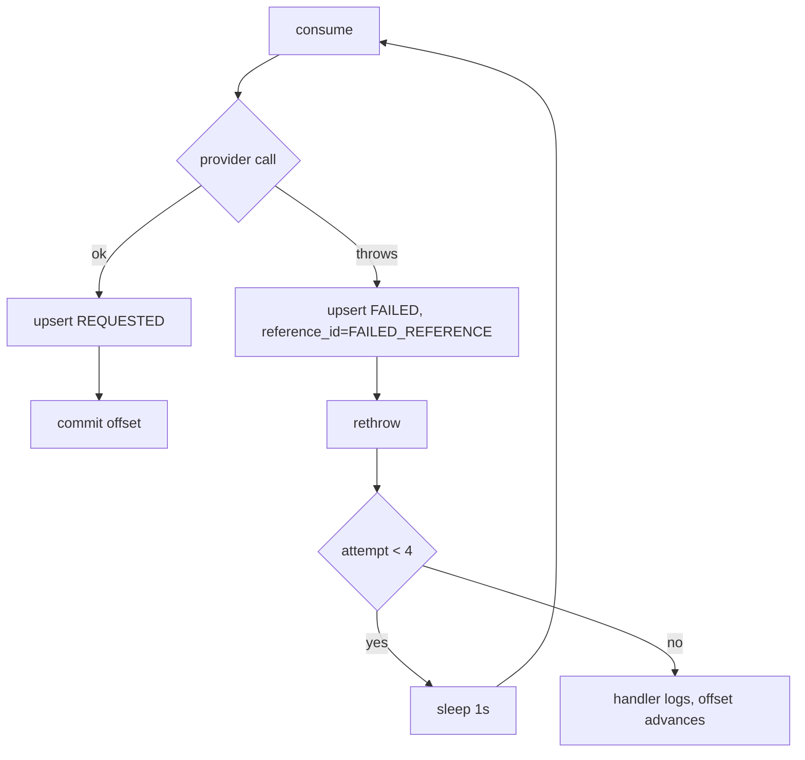

# Error Handling

Two independent mechanisms: a `@ControllerAdvice` for the synchronous REST edge,
and a Kafka `DefaultErrorHandler` for the asynchronous delivery half. They never
interact — a delivery failure cannot influence an HTTP response, because the
response was already sent.

## REST edge

`GlobalExceptionHandler` maps exceptions to `ErrorDto(String data, int status)`,
with the same `status` in both the body and the HTTP status line.

| Exception | Status | `data` |
|-----------|--------|--------|
| `ResponseStatusException` | the exception's own | `ex.getMessage()` |
| `MethodArgumentNotValidException` | 400 | first field error's message |
| `ConstraintViolationException` | 400 | `ex.getMessage()` |
| `ValidationException` | 400 | `ex.getMessage()` |
| `MissingServletRequestParameterException` | 400 | `ex.getMessage()` |
| `Exception` (catch-all) | 500 | `ex.getMessage()` |

Two things to know:

- `MethodArgumentNotValidException` reports **only the first** field error. A
  body with three invalid fields yields one message; fix, resubmit, discover the
  next.
- The catch-all returns `ex.getMessage()` verbatim at 500. For a DB or driver
  exception that can leak connection strings, table names, or constraint
  details to the caller.

Success responses use a different record — `ResponseDto(Object data, int status)` —
so clients see `data` as an object/array on success and a string on error.

### Status codes by endpoint

| Code | Where it comes from |
|------|--------------------|
| 200 | status lookup, inbox read, OTP request, OTP validate |
| 201 | any send or template trigger; template creation |
| 400 | bean validation; `toEmail`/`toMobile` null; missing query param; unsupported `langCode`; neither email nor sms on OTP; unbound template variable |
| 401 | OTP mismatch |
| 404 | OTP id unknown/expired; template not found |
| 409 | duplicate template; inactive template |
| 500 | anything unhandled |

Note `POST /notification/*` never returns a delivery error. Vendor failures are
invisible at the REST layer by construction.

## Kafka delivery

```java
new DefaultErrorHandler(new FixedBackOff(1000L, 3))
```

**4 total attempts** — 1 initial + 3 retries, 1 second apart. Fixed backoff, no
jitter, no exponential growth.



Every consumer follows the same try/catch shape: persist the outcome first, then
rethrow so the container's retry machinery sees the failure. Because the write
happens on every attempt, the row reflects the latest attempt only — a
fail-then-succeed sequence ends as `REQUESTED` with the successful reference id.

### After the retries

There is **no dead-letter topic and no `DeadLetterPublishingRecoverer`**. Once
the budget is spent, `DefaultErrorHandler` logs and the offset advances. The
message is gone. The only evidence is the `notifications` row sitting at
`FAILED` with `retry_count = 3` — nothing scans for those, so a permanently
failed notification is silently dropped unless someone polls the status
endpoint.

### Retrying the wrong failures

The catch is `catch (Exception e)`, so permanent errors retry exactly like
transient ones. A malformed phone number or a rejected sender address burns four
attempts and four seconds of a consumer thread before being abandoned. There is
no classification of retryable vs non-retryable, which `DefaultErrorHandler`
supports via `addNotRetryableExceptions`.

### Blocking retries

`FixedBackOff` blocks the consumer thread during the wait. With the default
concurrency of 1 per listener, one slow-failing message stalls its whole
partition for ~4 seconds. Neither `RestClient` sets a timeout, so an
unresponsive vendor stalls it indefinitely.

### Ordering of persistence and ack

The DB write commits in its own transaction, before the rethrow and before any
offset handling. A crash between the write and the offset commit causes the
message to be redelivered and the row to be rewritten — harmless, since
`saveOrUpdateNotification` upserts by `requestId`, but it does mean a delivery
can be attempted twice against the vendor. Herald has no idempotency key on the
outbound side, so the recipient may receive a duplicate.

## Publish-side failures

`KafkaProviderService.sendMessage` discards the `CompletableFuture` returned by
`kafkaTemplate.send`. If the broker is unreachable or rejects the record, no
callback observes it, nothing is logged by the application, and the caller has
already received `201` with a `requestId` that will never produce a row. This is
the widest gap in the pipeline: the acknowledgement is unconditional.
