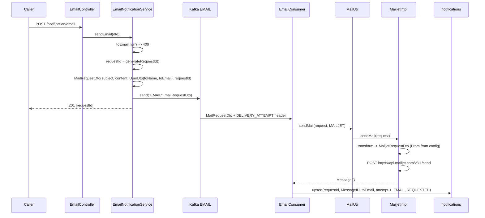
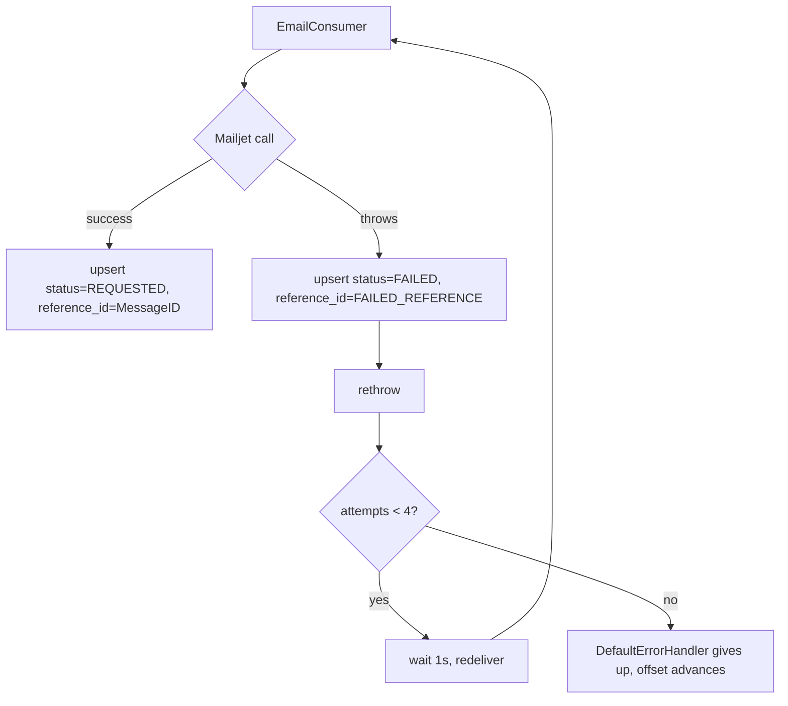

# Flow: Email

`POST /notification/email` → Kafka `EMAIL` → Mailjet.

## Request

```json
{
  "toEmail": "someone@example.com",
  "toName": "Avi Rana",
  "subject": "Welcome to Herald",
  "content": "<h1>Hello</h1>"
}
```

`201 Created`:

```json
{ "data": ["3f0c...-1754380800000"], "status": 201 }
```

## Sequence



## Step detail

**1. Controller** — `EmailController` is `@Valid`-annotated, but
`EmailNotifRequestDto` carries no constraint annotations, so bean validation is
a no-op here.

**2. Service validation** — only one check:

```java
if (Objects.isNull(request.getToEmail()))
    throw new ResponseStatusException(BAD_REQUEST, "toEmail can't be null for email");
```

Blank-but-not-null emails, and null `subject` / `content`, pass through and fail
later at Mailjet.

**3. Publish** — fire and forget. `KafkaProviderService.sendMessage` calls
`kafkaTemplate.send(topic, message)` and discards the returned future, so a
broker rejection is neither logged nor surfaced. The caller still gets its 201.

**4. Consumer** — binds `MailRequestDto` and the delivery-attempt header.

**5. Mailjet transform** — recipient comes from the event; sender comes from
config (`mail.mailjet.email` / `mail.mailjet.name`). Body is the raw `content`
string, sent as Mailjet's `HTMLPart`.

**6. Reference id** — extracted from the first message of the first recipient:

```java
response.Messages().getFirst().To().getFirst().MessageID()
```

If Mailjet returns a 2xx with an empty `Messages` array this throws
`NoSuchElementException`, which is handled exactly like a delivery failure.

**7. Persist** — `CommonPersistanceService.saveOrUpdateNotification` looks the
row up by `requestId` and inserts or updates. `retryCount` is stored as
`deliveryAttempt - 1`, so the first pass records `0`.

## Failure path



The row is written **before** the rethrow, so the last write wins: a request
that fails then succeeds on retry ends as `REQUESTED`; one that exhausts all
four attempts stays `FAILED` with `retry_count = 3`.

## Status semantics

Success is recorded as `REQUESTED`, not `SUCCESS` — `NotificationStatusEnum`
only has `FAILED`, `REQUESTED`, `QUEUED`. `REQUESTED` here means "Mailjet
accepted it and returned a MessageID". Herald consumes no Mailjet webhooks, so
bounces, spam blocks, and rejections after acceptance are invisible to it.

## Callers

`EmailNotificationService.sendEmail` is also invoked by
[OtpService](otp.md) and [TemplateService](template.md). Both build an
`EmailNotifRequestDto` and enter at step 2 above, so everything on this page
applies to them too.
