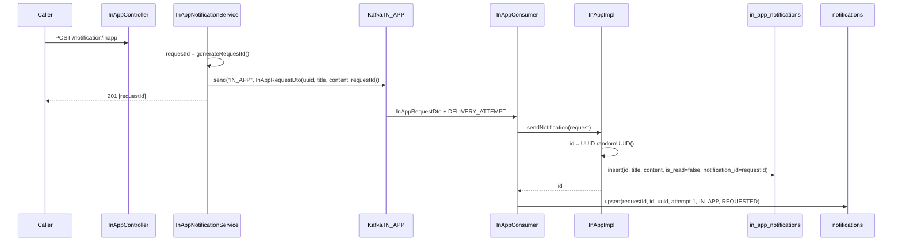
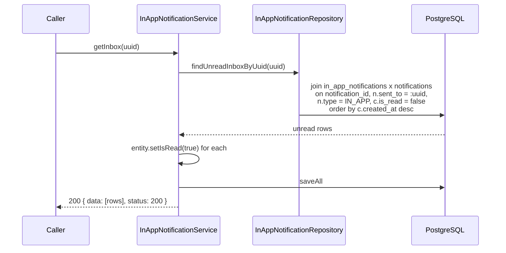

# Flow: In-App

Two halves: a write path that queues a notification into the user's inbox, and a
read path that drains it.

## Write: `POST /notification/inapp`

```json
{
  "uuid": "550e8400-e29b-41d4-a716-446655440000",
  "title": "New message",
  "content": "You have a new in-app notification."
}
```

All three fields are `@NotBlank` — this is the only channel with real bean
validation, so a blank field returns `400` with the constraint's message.



There is no external vendor. "Delivery" means inserting a row into
`in_app_notifications`; the reference id is a fresh random UUID rather than a
vendor message id.

Note the write ordering: the inbox row is inserted with
`notification_id = requestId` **before** the `notifications` row with that
primary key exists, and each write commits in its own transaction. The FK
`in_app_notifications.notification_id -> notifications.notification_id` is
checked at commit of the first write. See
[known-issues.md](../known-issues.md#in-app-inbox-insert-precedes-its-fk-parent).

## Read: `GET /notification/inapp?uuid=<uuid>`



The query resolves the recipient indirectly: `in_app_notifications` has no
`uuid` column, so it joins to `notifications.sent_to`, which the consumer
populated with the recipient uuid.

**The GET mutates state.** Every returned row is flipped to `is_read = true`
inside the same `@Transactional` method, so the endpoint is destructive-read:
call it twice and the second call returns an empty list. There is no separate
mark-as-read endpoint and no way to re-fetch history. Treat it as "drain my
unread queue", not "show my inbox".

The rows are marked read before the response is serialized, so a client that
drops the response has lost those notifications permanently.
