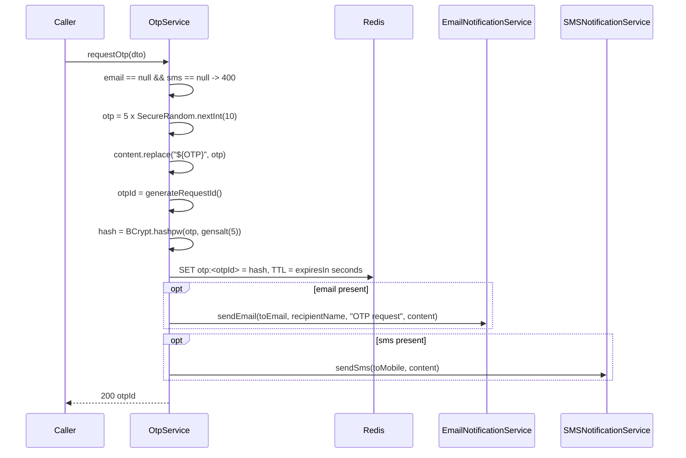
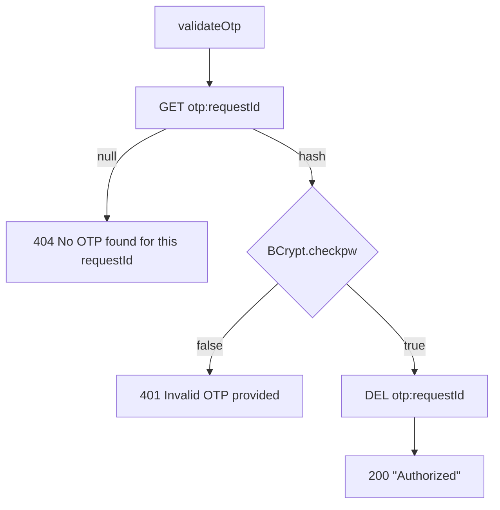

# Flow: OTP

OTP is a composition on top of the email and SMS channels plus a Redis store. It
owns no topic, no consumer, and no table.

## Issue: `POST /otp/request`

```json
{
  "email": { "toEmail": "someone@example.com", "recipientName": "Avi" },
  "sms":   { "toMobile": "+919999999999" },
  "content": "Your Herald OTP is ${OTP}. It expires in 5 minutes.",
  "expiresIn": 300
}
```

`200 OK` → `{ "data": "<otpId>", "status": 200 }`

Note the shape difference from the notification endpoints: `data` is a bare
string, not an array, and the status is 200, not 201.



### Rules

- At least one of `email` / `sms` must be present, else
  `400 at least one of email or sms must be provided`.
- `content` is `@NotBlank`; `expiresIn` is `@NotNull` (seconds).
- Nested targets are `@Valid`: `toEmail` and `toMobile` are `@NotBlank` when
  their block is present.
- The literal `${OTP}` in `content` is replaced with the generated code. It is a
  plain `String.replace`, unrelated to the `{{var}}` template engine. If you omit
  `${OTP}` the message goes out without the code — no error.
- **One code per request, not per channel.** The same OTP is hashed once, stored
  under one key, and sent to every requested channel. Either channel's copy
  validates.
- The subject line for the email variant is hardcoded to `"OTP request"`.

### Storage

| | |
|---|---|
| Key | `otp:<otpId>` |
| Value | BCrypt hash, `gensalt(5)` — 2^5 rounds |
| TTL | `expiresIn` seconds, set atomically with the value |

Expiry is Redis's job; nothing sweeps or checks timestamps in application code.

`gensalt(5)` is well below BCrypt's default of 10. For a 5-digit numeric code
(100k possibilities) an offline attacker with the hash brute-forces it
regardless, so the work factor is doing little here.

## Validate: `POST /otp/validate`

```json
{ "requestId": "<otpId>", "otp": "12345" }
```



Both fields are `@NotBlank`. `requestId` is the `otpId` from the issue call, not
a notification request id — the two id spaces are unrelated even though both are
minted by `RequestUtils.generateRequestId()`.

A `404` is ambiguous by design: never issued, already consumed, and TTL-expired
are indistinguishable.

### No attempt limiting

Nothing counts failed attempts. A wrong code returns 401 and leaves the key
intact until its TTL runs out, so a 5-digit code is brute-forceable within the
validity window at whatever rate the caller can drive. There is no lockout, no
rate limit, and no per-IP throttle anywhere in the service.

## Delivery is not confirmed

`requestOtp` returns 200 as soon as the hash is in Redis. The email/SMS calls it
makes are themselves async publishes — they return a `requestId` that
`OtpService` **discards**. So:

- The caller cannot correlate an OTP with its underlying notification rows.
- A Mailjet or Twilio failure never affects the OTP response.
- An OTP can be live in Redis while the message never left the building.
