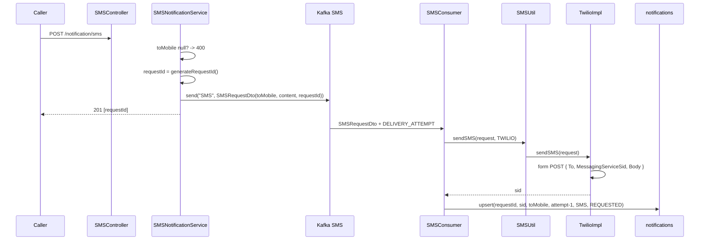

# Flow: SMS

`POST /notification/sms` → Kafka `SMS` → Twilio.

Structurally identical to [email](email.md); the differences are listed below.

## Request

```json
{
  "toMobile": "+919999999999",
  "content": "This is a test SMS from Herald."
}
```

`201 Created` → `{ "data": ["<requestId>"], "status": 201 }`

## Sequence



## Differences from email

| | Email | SMS |
|---|---|---|
| Content type | `application/json` | `application/x-www-form-urlencoded` |
| URL | base + `send` | base URL as-is, no path suffix |
| Sender | `mail.mailjet.email` | `MessagingServiceSid` = `${TWILIO_SERVICE_ID}` |
| Reference id | `MessageID` | `sid` |
| `sent_to` column | `toEmail` | `toMobile` |

`TwilioImpl` posts to the configured base URL directly, so `TWILIO_BASEURL` must
be the full Messages resource, e.g.
`https://api.twilio.com/2010-04-01/Accounts/<AccountSid>/Messages.json`.

## Provider lookup difference

`MailUtil` null-checks the resolved provider and throws `BadRequestException`
for an unknown key. `SMSUtil` does not:

```java
SMSProvider smsProvider = providerList.get(providerName);
return smsProvider.sendSMS(request);   // NPE if unmapped
```

With `TWILIO` as the only enum constant this is unreachable today, but a new
`SMSProviderEnum` constant without a matching `<Vendor>Impl` bean would NPE
inside the consumer — caught by the generic `catch (Exception e)`, so it
persists as `FAILED` and burns all four delivery attempts.

## Validation

Only `toMobile != null`. No E.164 format check — malformed numbers are rejected
by Twilio at delivery time and land as `FAILED`.
