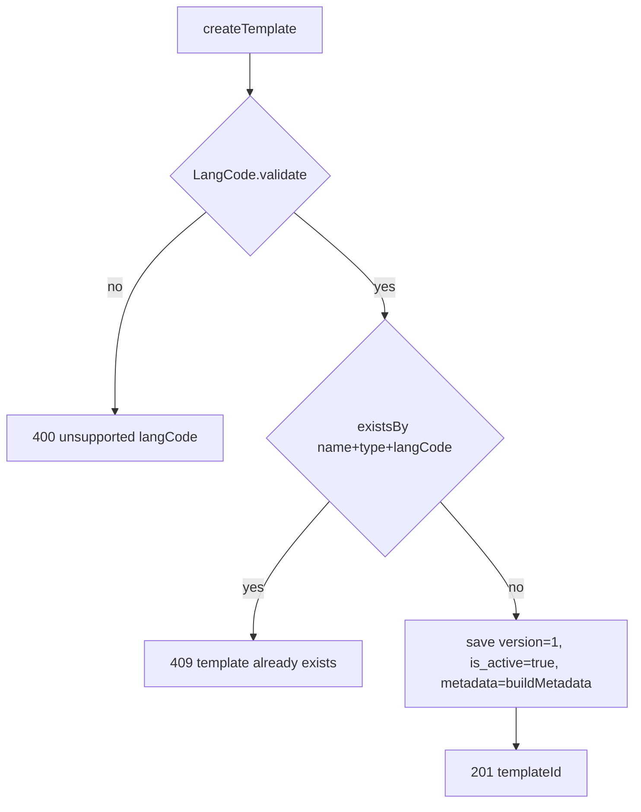
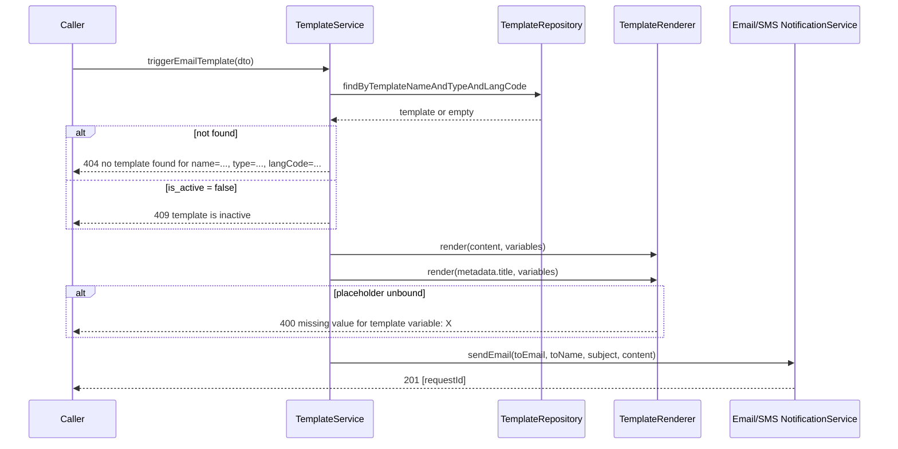

# Flow: Templates

Templates decouple message copy from the caller. Create once, trigger many times
with variable bindings.

## Model

`CommonTemplateCreationDto` is abstract; each channel subclasses it and declares
its own `NotifTypeEnum` plus any channel-specific fields folded into a JSONB
`metadata` blob.

```mermaid
classDiagram
    class CommonTemplateCreationDto {
        templateName*
        content*
        langCode*
        variables
        +getType()*
        +buildMetadata()
    }
    class EmailTemplateCreationDto {
        title*
        getType() = EMAIL
        buildMetadata() = {title}
    }
    class SMSTemplateCreationDto {
        getType() = SMS
    }
    CommonTemplateCreationDto <|-- EmailTemplateCreationDto
    CommonTemplateCreationDto <|-- SMSTemplateCreationDto
```

`title` is email-only because SMS has no subject line. It lands in
`templates.metadata->>'title'` rather than a dedicated column, so a future
channel can add its own fields without a migration.

## Create: `POST /template/create/{email|sms}`

```json
{
  "templateName": "order-confirmation",
  "langCode": "en",
  "title": "Order {{orderId}} confirmed",
  "content": "<p>Hi {{customerName}}, your order {{orderId}} is confirmed.</p>",
  "variables": ["customerName", "orderId"]
}
```

`201 Created` → `{ "data": ["<templateUuid>"], "status": 201 }`



- `langCode` must be one of `en es fr de hi pt zh ja`, matched
  case-insensitively by `LangCode.validate`. It is stored **as supplied**, so
  creating with `EN` and triggering with `en` will not find the template — the
  lookup is an exact string match. Pick one casing and stay on it.
- Uniqueness is `(template_name, type, lang_code)`, enforced both in code and by
  the DB constraint `uq_template`. The same name can exist for EMAIL and SMS.
- `variables` is a declared list, persisted to JSONB, but never validated
  against `content` at creation time and never consulted at trigger time. It is
  documentation, not a contract.
- `version` is always written as `1` and `is_active` as `true`. Nothing in the
  API bumps versions or deactivates templates — the columns exist for a
  lifecycle that is not implemented. There is no update, delete, or list
  endpoint; changing copy means editing the row directly.

## Trigger: `POST /template/trigger/{email|sms}`

```json
{
  "templateName": "order-confirmation",
  "langCode": "en",
  "toEmail": "someone@example.com",
  "toName": "Avi Rana",
  "variables": { "customerName": "Avi", "orderId": "ORD-1042" }
}
```

The SMS variant swaps `toEmail`/`toName` for `toMobile`.



Past the render step this is exactly the [email](email.md) / [sms](sms.md) flow —
same topic, same consumer, same persistence, same `201 [requestId]`.

## Renderer

`TemplateRenderer` matches `\{\{\s*([\w.]+)\s*}}` and substitutes from the
supplied map.

- Whitespace inside the braces is tolerated: `{{ orderId }}` works.
- Keys are word characters plus `.`, so `{{user.name}}` is one key named
  `user.name` — there is no nested object traversal.
- A placeholder with no entry in `variables` throws
  `400 missing value for template variable: <key>`. Strict by default, so a
  half-rendered message is never sent.
- Extra entries in `variables` that the template does not reference are ignored.
- Values are inserted via `Matcher.quoteReplacement`, so `$` and `\` in a value
  are literal — but the result is **not** HTML-escaped. A value containing markup
  is injected raw into the email body.
- `render(null, ...)` returns null. For an email template created without a
  title this yields a null subject, which Mailjet will reject at send time.

Rendering runs on both `content` and the email `title`, so subjects can carry
placeholders too — and an unbound placeholder in the subject fails the whole
request the same way.

## `{{ }}` and API clients

Herald's placeholder syntax is the same as Bruno's and Postman's variable
syntax. In the [Bruno collection](../../apis/) the sample bodies use
`customerName` / `orderId`, deliberately chosen not to collide with any
environment variable — an env var of the same name would be substituted by the
client before the request ever reached Herald.
